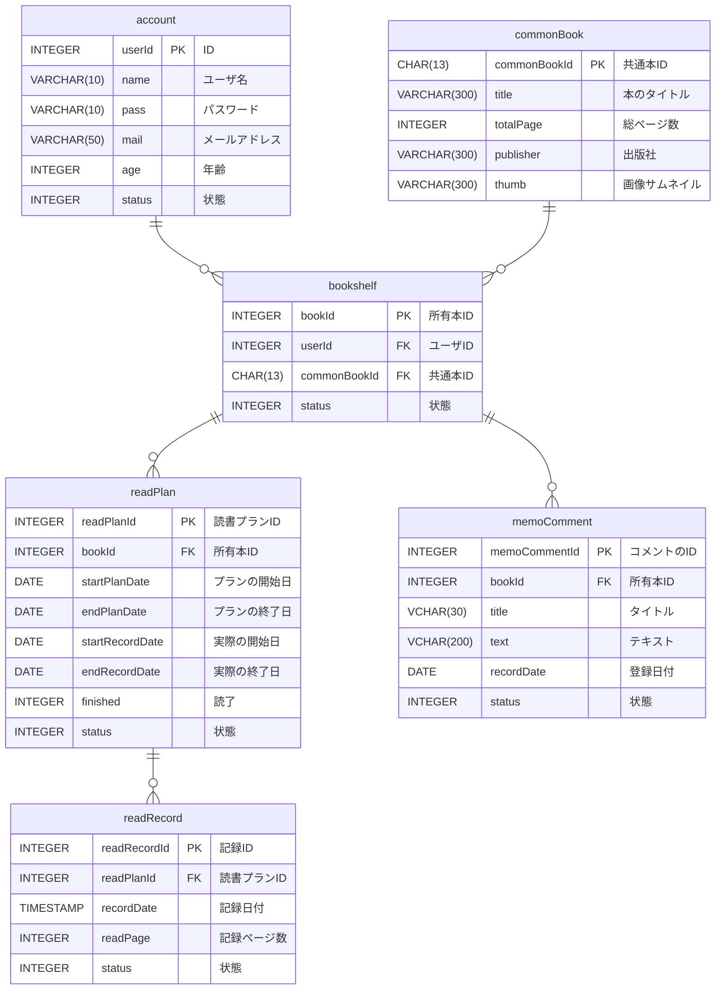
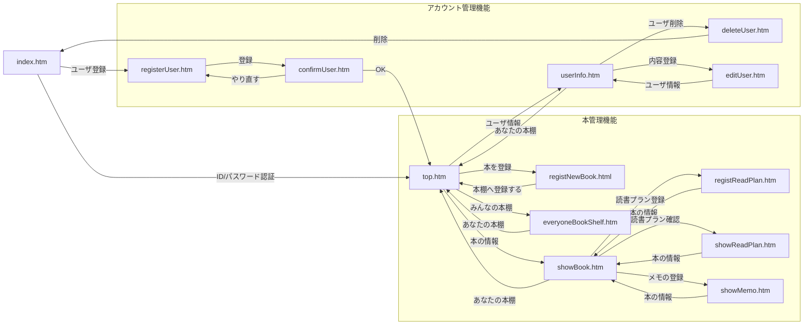

# アプリの説明

## 概要
- 職業訓練校の演習で制作した読書管理Webアプリです。

  
## 開発環境  
- 言語：Java  
- フレームワーク：SpringBoot  
- データベース：postgresql 
- ビルドツール：gradle

## 制作理由
  
- JavaSilverやOracleMasterSilverの資格試験を取得するため、参考書で勉強しましたが、資格取得の本においては、1回で読み切るよりも、期間を決めて、何周も読んで内容を覚えることが重要だと考えました。  
- そのため、それらを可視化するアプリを作成しました。

## 機能定義
- システム名：読書プラン進捗アプリ  
- 目的：購入した本を登録して、読書プランを立て、進捗を記入する。ついでに、本の内容をメモる。

### アプリ用語
- 本棚：ユーザが所有する本の集まり。ユーザは本棚を１つのみ持つ。 
- 所有本：ユーザが所有している本。同じ本棚に重複はない。 
- 読書プラン：「いつからいつまでに読もう」という読書の計画  
- 読書履歴：「その日ここまでよんだ」という進捗   
- メモ：所有本に紐づくメモ書き  
- 共通本：アプリに登録されている全ての本の集まり 　
- ISBN：97からはじまる13桁のISBN情報。共通本のPK 
- 周回： 1からはじまる読んだ回数(表記：◯周目)

### 各機能
1) ユーザ情報  
登録：IDとPWの入力が必要。入力した値はDBに保存する。同じユーザ名は登録しない。  
削除：ユーザーの登録削除をする。削除は論理削除(statusに-1を代入)。  
更新：ユーザー情報の編集・更新をする  
ログイン：登録したユーザー情報でログインする  
ログアウト：ログアウトするとログイン画面に戻る
  
2) 本棚  
登録：本のISBNを入力し、本棚にISBNを登録する。同じ本棚に同じ本は2つ以上存在しない。  
確認：本棚の一覧を表示する。  
  
3) 読書プラン  
登録：下記入力。  
　読書を開始する日(デフォは登録日)  
　目標とする日(デフォは登録日の2週間後)    
更新：読書プランの概要を確認。修正する。  

4) 読書プラン進捗  
登録：読書プラン上の現時点での読んだページ数を登録する。  
確認：読んだ進捗をグラフで表示する(グラフ用js[chart.js]を使用)  
削除：読んだ進捗を削除する。  

5) メモ  
入力：所有本に対するメモを入力。  
削除：メモを削除する。  

6) 共通本  
登録：GoogleBooksAPIsを使用して、本の情報を登録する。

7) その他  
他ユーザ内容の公開：他ユーザの本棚/本/読書プランを閲覧する  

### テーブル定義
1) account：ユーザアカウントの登録・管理テーブル

| No | 主キー | 外部キー | カラム名   | 項目名     | データ型        | NOT NULL | 一意制 | default | 更新 | 備考               |
|----|-----|------|--------|---------|-------------|----------|-----|---------|----|------------------|
| 1  | 〇   |      | userId | ID      | INTEGER     | 〇        | 〇   |         |    | SERIAL           |
| 2  |     |      | name   | ユーザ名    | VARCHAR(10) | 〇        | 〇   |         |    | 同じ名前のユーザー名は存在しない |
| 3  |     |      | pass   | パスワード   | VARCHAR(60) | 〇        |     |         |    |                  |
| 4  |     |      | mail   | メールアドレス | VARCHAR(50) | 〇        |     |         |    |                  |
| 5  |     |      | age    | 年齢      | INTEGER     | 〇        |     |         |    |                  |
| 6  |     |      | status | 状態      | INTEGER     | 〇        |     | 0       |    | 削除=-1            |  

2) bookshelf ： 所有本の登録テーブル

| No | 主キー | 外部キー | カラム名         | 項目名   | データ型         | NOT NULL | 一意制                         | default | 更新 | 備考                        |
|----|-----|------|--------------|-------|--------------|----------|-----------------------------|---------|----|---------------------------|
| 1  | 〇   |      | bookId       | 所有本ID | INTEGER      | 〇        | 〇                           |         |    | SERIAL                    |
| 2  |     | 〇    | userId       | ユーザID | INTEGER      | 〇        | user_id,commonBook_idの組み合わせ |         |    |                           |
| 3  |     | 〇    | commonBookId | 共通本ID | CHAR(13)     | 〇        | user_id,commonBook_idの組み合わせ |         |    | 同じユーザが同じ共通本IDを登録できないようにする |
| 4  |     |      | status       | 状態    | INTEGER      | 〇        |                             | 0       |    | 削除=-1、読書中=0               |  

3) readPlan　： 読書プランの登録・管理テーブル  

| No | 主キー | 外部キー | カラム名            | 項目名     | データ型    | NOT NULL | 一意制 | default | 更新 | 備考              |
|----|-----|------|-----------------|---------|---------|----------|-----|---------|----|-----------------|
| 1  | 〇   |      | readPlanId      | 読書プランID | INTEGER | 〇        | 〇   |         |    | SERIAL          |
| 2  |     | 〇    | bookId          | 所有本ID   | INTEGER | 〇        |     |         |    |                 |
| 4  |     |      | startPlanDate   | プランの開始日 | DATE    | 〇        |     |         |    |                 |
| 5  |     |      | endPlanDate     | プランの終了日 | DATE    | 〇        |     |         |    |                 |
| 6  |     |      | startRecordDate | 実際の開始日  | DATE    |          |     |         |    |                 |
| 7  |     |      | endRecordDate   | 実際の終了日  | DATE    |          |     |         |    |                 |
| 8  |     |      | finished        | 読了      | INTEGER |          |     | 0       |    | 読了=1            |
| 9  |     |      | status          | 状態      | INTEGER | 〇        |     | 0       |    | 削除(非表示)=-1,表示=0 |

4) readRecord	：読書の記録の登録・管理テーブル  

| No | 主キー | 外部キー | カラム名         | 項目名     | データ型      | NOT NULL | 一意制 | default | 更新 | 備考         |
|----|-----|------|--------------|---------|-----------|----------|-----|---------|----|------------|
| 1  | 〇   |      | readRecordId | 記録ID    | INTEGER   | 〇        | 〇   |         |    |            |
| 2  |     | 〇    | readPlanId   | 読書プランID | INTEGER   | 〇        |     |         |    |            |
| 3  |     |      | recordDate   | 記録日付    | TIMESTAMP | 〇        |     |         |    |            |
| 4  |     |      | readPage     | 記録ページ数  | INTEGER   | 〇        |     |         |    |            |
| 5  |     |      | status       | 状態      | INTEGER   | 〇        |     | 0       |    | 削除(非表示)=-1 |

5) memoComment ：メモに入力した内容の登録・管理テーブル 

| No | 主キー | 外部キー | カラム名          | 項目名     | データ型       | NOT NULL | 一意制 | default | 更新 | 備考         |
|----|-----|------|---------------|---------|------------|----------|-----|---------|----|------------|
| 1  | 〇   |      | memoCommentId | コメントのID | INTEGER    | 〇        | 〇   |         |    | SERIAL     |
| 2  |     | 〇    | bookId        | 所有本ID   | INTEGER    | 〇        |     |         |    |            |
| 3  |     |      | title         | タイトル    | VCHAR(30)  |          |     |         |    |            |
| 4  |     |      | text          | テキスト    | VCHAR(300) | 〇        |     |         |    |            |
| 5  |     |      | recordDate    | 登録日付    | DATE       | 〇        |     |         |    |            |
| 6  |     |      | status        | 状態      | INTEGER    | 〇        |     | 0       |    | 削除(非表示)=-1 |  

6)  commonBook ：共通本の登録・管理テーブル  

| No | 主キー | 外部キー | カラム名         | 項目名     | データ型         | NOT NULL | 一意制 | default | 更新 | 備考                 |
|----|-----|------|--------------|---------|--------------|----------|-----|---------|----|--------------------|
| 1  | 〇   |      | commonBookId | 共通本ID   | CHAR(13)     | 〇        | 〇   |         |    | 97からはじまるISBNコード    |
| 2  |     |      | title        | 本のタイトル  | VARCHAR(300) | 〇        |     |         |    |                    |
| 3  |     |      | totalPage    | 総ページ数   | INTEGER      | 〇        |     |         |    |                    |
| 4  |     |      | publisher    | 出版社     | VARCHAR(300) | 〇        |     |         |    |                    |
| 5  |     |      | thumb        | 画像サムネイル | VARCHAR(300) | 〇        |     |         |    |                    |

### ER図  

### 画面設計

1) index.htm  

【部品の説明】	

| 部品番号 | 種類       | 説明          |
|------|----------|-------------|
| ①    | テキストボックス | ユーザIDを入力する  |
| ②    | テキストボックス | パスワードを入力する  |
| ③    | ボタン      | ログイン処理を実行する |
| ④    | リンク      | 登録画面に遷移する。  |

【操作概要】  
1. 初期     
　ユーザID、パスワードの各欄が空白になっている。    
2. 「ログインボタン」の押下    
　ユーザが確認ボタンを押下すると、必要な箇所(①および②)が入力されたことをチェックし、問題がなければ、メイン画面に遷移する。
　問題があれば、同ページにリダイレクトする。    
3. 「新規登録」の押下    
　ユーザが「新規登録」ボタンを押下すると、ユーザ登録画面に遷移する。  
  
  
  
2) top.htm  

【部品の説明】  
| 部品番号 | 種類      | 説明                                                                                                                         |
|------|---------|----------------------------------------------------------------------------------------------------------------------------|
| ①    | EL式     | ～(ユーザ名／他ユーザ名）の本棚～と表示                                                                                                       |
| ②    | EL式＆リンク | 本1のタイトル                                                                                                                    |
| ③    | 画像      | 本1の画像                                                                                                                      |
| ④    | リンク     | 本に紐づけられた読書プランの有無で表示が切り替わる。  読書プラン有： 「ここまで読んだ(〇%)」：本1の既読ページの簡易情報が表示される。 読書プラン無： 「プランをたてる」：読書プラン登録を促す表示。 |
| ⑤    | リンク     | 本に紐づけられたメモ帳の有無で表示が切り替わる。   メモ帳有： 「メモ帳を見る」と表示される。 メモ帳無： 「メモする」：メモ入力を促す表示。                     |
| ⑥    | EL式     | 本1の周回                                                                                                                |
| ⑦    | リンク     | 本棚の本の登録画面へ遷移。                                                                                                              |
| ⑧    | リンク     | 他ユーザの本棚一覧へのリンク                                                                                                       |
| ⑨    | リンク     | ユーザ情報画面へのリンク                                                                                                               |
| ⑩    | リンク     | 自分の本棚へのリンク（他ユーザの本棚を見ている時表示）                                                                                                |

【操作概要】  
1. 初期  
　〇〇さん(ログインユーザあるいは他ユーザの)の本棚がヘッダに表示されている。
　ボディ部には本情報のリストが並んでいる(時間があればページネーションする)。  
2. 「本1のタイトル」をクリック  
　(本棚に登録されている)本の情報(showBook)へ遷移する。  
  
3. 「本1の情報」をクリック。  
(3-A)読書プラン有：
「ここまで読んだ(〇%)」：読書プランの状態へ遷移(showReadPlan)  
(3-B)読書プラン無：
「プランをたてる」：読書プランの登録ページへ遷移(registReadPlan)   
  
4. 「本1のメモ帳」をクリック。  
　メモ帳一覧へ遷移(showMemo)する。  
  
5. 「本を登録ボタン」の押下  
　本棚の本の登録画面(registNewBook)に遷移する。  
  
6. 「みんなの本棚」の押下  
　みんなの本棚(everyOneBookList)へ遷移する。  
  
7. 「ユーザ情報」の押下  
　ユーザ情報画面(userInfo)へ遷移する。  
  
8. 「じぶんの本棚」の押下  
　自分の本棚(main)へ遷移する。  
  
3) everyoneBookShelf.html  
  

【部品の説明】
| 部品番号 | 種類      | 説明               |
|------|---------|------------------|
| ①    | リンク     | 表示、内容            |
| ②    | EL式＆リンク | Aさんの本棚へのリンク      |
| ③    | 画像      | 所有本の画像のサムネイル＆リンク |
| ④    | リンク     | 自分の本棚へ遷移         |

【操作説明】  
1. 初期  
　他のユーザの本棚の本が並ぶ。  
  
2. Aさんの本棚をクリック  
　Aさんの本棚(main)へ遷移する。  
  
3. 「画像のサムネイル」をクリック  
　(本棚に登録されている)本の情報(showBook)へ遷移する。  
  
4. 「自分の本棚へ」の押下  
　自分の本棚(main.html)へ遷移する。  

4) showBook.html  
  

【部品の説明】
| 部品番号 | 種類       | 説明                   |
|------|----------|----------------------|
| ①    | EL式      | 〇〇さんの本を表示            |
| ②    | EL式      | タイトルを表示              |
| ③    | EL式      | 総ページ数                |
| ④    | EL式      | 出版社表示                |
| ⑤    | EL式      | 画像サムネイル              |
| ⑥    | チェックボックス | 公開/非公開　※本棚の所有者以外は非表示 |
| ⑦    | リンク      | ここまで読んだ(〇〇％)         |
| ⑧    | リンク      | メモ帳を見る               |

【操作説明】
1. 初期  
　本の情報が表示されている。  
　他ユーザの本棚を閲覧している場合は「公開/非公開」は非表示。
　内容は編集できない。  
2. 「ここまで読んだ」をクリック。  
　　読書履歴編集画面へ。  
3. 「メモ帳を見る」をクリック。  
　メモ帳編集画面へ  
  
4. 「本棚に戻る」をクリック。  
　本棚に戻る(main.html)  

5) deleteUser.html  

  

【部品の説明】  
| 部品番号 | 種類  | 説明             |
|------|-----|----------------|
| ①    | EL式 | ユーザIDを表示する     |
| ②    | リンク | アカウント登録削除処理が起動 |

【操作説明】
1. 初期  
　「〇〇さん、登録を削除しますか？」の表示とリンクボタンが表示される。  
2. 「削除する」の押下  
　押下すると、アカウント登録処理が起動して、トップ画面に遷移する。
　問題があれば、同ページにリダイレクトする。  

6) registerUser.htm  

| 部品番号 | 種類       | 説明                                 |
|------|----------|------------------------------------|
| ①    | テキストボックス | ユーザ名を入力する。                         |
| ②    | テキストボックス | メールアドレスを入力する。                      |
| ③    | テキストボックス | パスワードを入力する。                        |
| ④    | ボタン      | 登録確認ページ(registerUserConfirm)へ遷移する。 |

操作概要  
1. 初期  
　ユーザ名、メールアドレス、パスワードの各欄が空白になっている。  
2. 「確認ボタン」の押下  
　ユーザが確認ボタンを押下すると、必要な箇所(①～③)が入力されたことをチェック(※)し、問題がなければ、メイン画面に遷移する。  
　問題があれば、同ページにて注意を促す。   
※チェック項目  
・重複するユーザ名が存在しない。  
・メールアドレスが正規。   
・パスワードが1文字以上。   

7) editUser.htm  
  

【部品の説明】  
| 部品番号 | 種類       | 説明                           |
|------|----------|------------------------------|
| ①    | テキストボックス | ユーザ名を入力する。                   |
| ②    | テキストボックス | メールアドレスを入力する。                |
| ③    | テキストボックス | パスワードを入力する。                  |
| ④    | ボタン      | ユーザ情報画面(userInfo.html)へ遷移する。 |

【操作説明】  
1. 初期  
　ユーザ名、メールアドレス、パスワードの各欄が空白になっている。  
2. 「確認ボタン」の押下  
　ユーザが確認ボタンを押下すると、必要な箇所(①～③)が入力されたことをチェック(※)し、問題がなければ、メイン画面に遷移する。  
　問題があれば、同ページにて注意を促す。   
※チェック項目  
・重複するユーザ名が存在しない。  
・メールアドレスが正規。   
・パスワードが1文字以上。 

8) comfirmUser.htm  
  

【部品の説明】  
| 部品番号 | 種類  | 説明                |
|------|-----|-------------------|
| ①    | EL式 | ユーザ名              |
| ②    | EL式 | メールアドレス           |
| ③    | EL式 | パスワード             |
| ④    | ボタン | トップページ(top)へ遷移する。 |

【操作説明】 
1. 初期　　
　ユーザ名、メールアドレス、パスワードの内容が表示されている。　　
2. 「確認ボタン」の押下　　
　ユーザが確認ボタンを押下すると、トップページ画面に遷移する。　　

9) userInfo.htm  
  

【部品の説明】
| 部品番号 | 種類  | 説明                              |
|------|-----|---------------------------------|
| ①    | EL式 | ユーザ名                            |
| ②    | EL式 | メールアドレス                         |
| ③    | EL式 | パスワード                           |
| ④    | ボタン | ユーザ情報編集画面(editUser.htm)へ遷移する。   |
| ⑤    | リンク | ユーザ登録削除画面(deleteUser.htm)へ遷移する。 |

【操作説明】
1. 初期  
ユーザ名、メールアドレス、パスワードの内容が表示されている。　　
2. 「ユーザ情報編集画面」の押下  
ボタンを押下すると、ユーザ情報編集画面へ遷移する。　　
3. 「ユーザ削除」リンクのクリック  
ユーザ登録削除画面へ遷移する。　　

10) showReadPlan.htm  

【部品の説明】
| 部品番号 | 種類      | 説明          |
|------|---------|-------------|
| ①    | EL式     | タイトル        |
| ②    | EL式     | 読んだページ      |
| ③    | EL式     | 進捗(%)       |
| ④    | EL式     | 読む速さ(平均)    |
| ⑤    | カレンダー入力 | 日付          |
| ⑥    | テキスト入力  | ページ         |
| ⑦    | ボタン     | 読書履歴登録処理が軌道 |
| ⑧    | キャンバス画像 | グラフ         |
| ⑨    | リンク     | 本棚にもどる      |
【】
1. 初期  
「日付」は現在の日付、「ページ」は既存ページが入力されている。  
他人の読書プランを閲覧している場合、入力はできないようにする。  
2. 「＋」の押下  
　日付とページの内容をチェックし、問題なければ、読書履歴登録処理が起動し、ページが更新される。  
3. 「本棚に戻る」の押下  
　本棚に戻る。 
  
11) registNewBook.htm  

  
【部品の説明】  
| 部品番号 | 種類       | 説明                  |
|------|----------|---------------------|
| ①    | テキストボックス | ISBNを入力する。          |
| ②    | ボタン      | ISBNから本の情報を取得するボタン。 |
| ③    | EL式      | タイトル表示              |
| ④    | EL式      | 総ページ数               |
| ⑤    | EL式      | 出版社表示               |
| ⑥    | EL式      | 画像サムネイル             |
| ⑦    | ボタン      | 本棚への本の登録処理を起動するボタン  |
  
【操作説明】  
1. 初期  
　①、③～⑥が空白になっている。  
  
2. 「本の情報を取得」の押下  
　ユーザがボタンを押下すると、必要な箇所(①)が入力されたことをチェックし、問題がなければ、ISBNから書籍情報を下の領域に出力する。  
※チェック内容：  
　ISBNコードが数字で構成されているか？  
　ISBN問い合わせして登録があるか？  
  
3. 「本棚に登録する」の押下  
　ボタンを押下すると、メイン画面(main.html)に遷移する。  

12) registReadPlan.htm  
  

【部品の説明】
| 部品番号 | 種類    | 説明                 |
|------|-------|--------------------|
| ①    | カレンダー | 読み始める日付            |
| ②    | カレンダー | 読み終わる日付            |
| ③    | EL式   | タイトル表示             |
| ④    | EL式   | 総ページ数              |
| ⑤    | EL式   | 出版社表示              |
| ⑥    | EL式   | 画像サムネイル            |
| ⑦    | ボタン   | 読書プランを登録処理を起動するボタン |

【操作説明】
1. 初期  
　①、③～⑥が空白になっている。  
2. 「本の情報を取得」の押下  
　ユーザがボタンを押下すると、必要な箇所(①)が入力されたことをチェックし、問題がなければ、ISBNから書籍情報を出力する。  
※チェック内容：  
　ISBNコードが数字で構成されているか？  
　ISBN問い合わせして登録があるか？  
3. 「本棚に登録する」の押下  
　ボタンを押下すると、メイン画面(main.html)に遷移する。  

13) showMemo.html

【部品の説明】
| 部品番号 | 種類      | 説明             |
|------|---------|----------------|
| ①    | EL式     | (ユーザ名）のさんの本棚の本 |
| ②    | EL式＆リンク | 本のタイトル         |
| ③    | 画像      | 本のサムネイル画像      |
| ④    | EL式     | 表示中のメモ         |
| ⑤    | EL式     | 他のメモ           |
| ⑥    | 編集      | メモのタイトル        |
| ⑦    | 編集      | メモの内容          |
| ⑧    | ボタン     | 内容を更新する        |
| ⑨    | リンク     | 新規メモをつくる       |
| ⑩    | ボタン     | 投稿ボタン          |
| ⑫    | リンク     | 本棚に戻る          |

【操作説明】  
1. 初期		
　ボディ部にはメモのリストが並んでいる(時間があればページネーションする)。		
2. 「投稿」をクリック		
　(本棚に登録されている)本の情報(showBook)へ遷移する。		

画面遷移  

