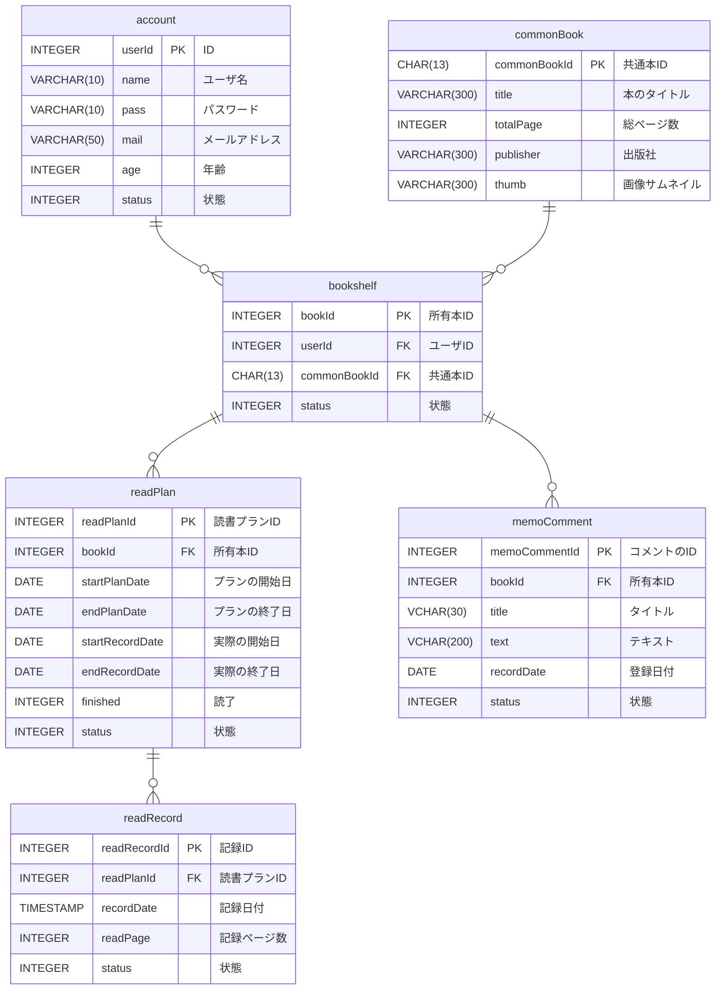
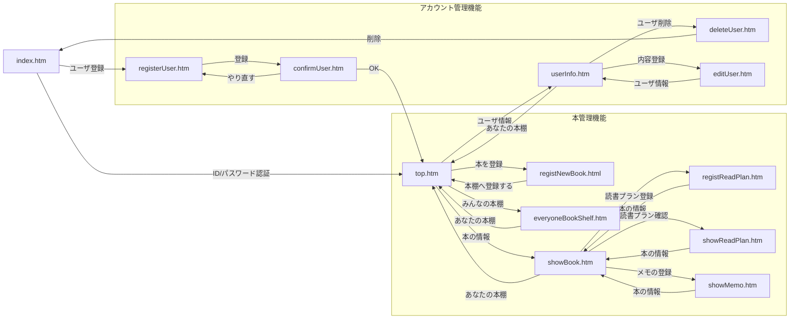

# アプリの説明

## 概要
- 職業訓練校の演習で制作した読書管理Webアプリです。

  
## 開発環境  
- 言語：Java  
- フレームワーク：SpringBoot  
- データベース：postgresql 
- ビルドツール：gradle

## 制作理由
  
- JavaSilverやOracleMasterSilverの資格試験を取得するため、参考書で勉強しましたが、資格取得の本においては、1回で読み切るよりも、期間を決めて、何周も読んで内容を覚えることが重要だと考えました。  
- そのため、それらを可視化するアプリを作成しました。

## 機能定義
- システム名：読書プラン進捗アプリ  
- 目的：購入した本を登録して、読書プランを立て、進捗を記入する。ついでに、本の内容をメモる。

### アプリ用語
- 本棚：ユーザが所有する本の集まり。ユーザは本棚を１つのみ持つ。 
- 所有本：ユーザが所有している本。同じ本棚に重複はない。 
- 読書プラン：「いつからいつまでに読もう」という読書の計画  
- 読書履歴：「その日ここまでよんだ」という進捗   
- メモ：所有本に紐づくメモ書き  
- 共通本：アプリに登録されている全ての本の集まり 　
- ISBN：97からはじまる13桁のISBN情報。共通本のPK 
- 周回： 1からはじまる読んだ回数(表記：◯周目)

### 各機能
1) ユーザ情報  
登録：IDとPWの入力が必要。入力した値はDBに保存する。同じユーザ名は登録しない。  
削除：ユーザーの登録削除をする。削除は論理削除(statusに-1を代入)。  
更新：ユーザー情報の編集・更新をする  
ログイン：登録したユーザー情報でログインする  
ログアウト：ログアウトするとログイン画面に戻る
  
2) 本棚  
登録：本のISBNを入力し、本棚にISBNを登録する。同じ本棚に同じ本は2つ以上存在しない。  
確認：本棚の一覧を表示する。  
  
3) 読書プラン  
登録：下記入力。  
　読書を開始する日(デフォは登録日)  
　目標とする日(デフォは登録日の2週間後)    
更新：読書プランの概要を確認。修正する。  

4) 読書プラン進捗  
登録：読書プラン上の現時点での読んだページ数を登録する。  
確認：読んだ進捗をグラフで表示する(グラフ用js[chart.js]を使用)  
削除：読んだ進捗を削除する。  

5) メモ  
入力：所有本に対するメモを入力。  
削除：メモを削除する。  

6) 共通本  
登録：GoogleBooksAPIsを使用して、本の情報を登録する。

7) その他  
他ユーザ内容の公開：他ユーザの本棚/本/読書プランを閲覧する  

### テーブル定義
1) account：ユーザアカウントの登録・管理テーブル

| No | 主キー | 外部キー | カラム名   | 項目名     | データ型        | NOT NULL | 一意制 | default | 更新 | 備考               |
|----|-----|------|--------|---------|-------------|----------|-----|---------|----|------------------|
| 1  | 〇   |      | userId | ID      | INTEGER     | 〇        | 〇   |         |    | SERIAL           |
| 2  |     |      | name   | ユーザ名    | VARCHAR(10) | 〇        | 〇   |         |    | 同じ名前のユーザー名は存在しない |
| 3  |     |      | pass   | パスワード   | VARCHAR(60) | 〇        |     |         |    |                  |
| 4  |     |      | mail   | メールアドレス | VARCHAR(50) | 〇        |     |         |    |                  |
| 5  |     |      | age    | 年齢      | INTEGER     | 〇        |     |         |    |                  |
| 6  |     |      | status | 状態      | INTEGER     | 〇        |     | 0       |    | 削除=-1            |  

2) bookshelf ： 所有本の登録テーブル

| No | 主キー | 外部キー | カラム名         | 項目名   | データ型         | NOT NULL | 一意制                         | default | 更新 | 備考                        |
|----|-----|------|--------------|-------|--------------|----------|-----------------------------|---------|----|---------------------------|
| 1  | 〇   |      | bookId       | 所有本ID | INTEGER      | 〇        | 〇                           |         |    | SERIAL                    |
| 2  |     | 〇    | userId       | ユーザID | INTEGER      | 〇        | user_id,commonBook_idの組み合わせ |         |    |                           |
| 3  |     | 〇    | commonBookId | 共通本ID | CHAR(13)     | 〇        | user_id,commonBook_idの組み合わせ |         |    | 同じユーザが同じ共通本IDを登録できないようにする |
| 4  |     |      | status       | 状態    | INTEGER      | 〇        |                             | 0       |    | 削除=-1、読書中=0               |  

3) readPlan　： 読書プランの登録・管理テーブル  

| No | 主キー | 外部キー | カラム名            | 項目名     | データ型    | NOT NULL | 一意制 | default | 更新 | 備考              |
|----|-----|------|-----------------|---------|---------|----------|-----|---------|----|-----------------|
| 1  | 〇   |      | readPlanId      | 読書プランID | INTEGER | 〇        | 〇   |         |    | SERIAL          |
| 2  |     | 〇    | bookId          | 所有本ID   | INTEGER | 〇        |     |         |    |                 |
| 4  |     |      | startPlanDate   | プランの開始日 | DATE    | 〇        |     |         |    |                 |
| 5  |     |      | endPlanDate     | プランの終了日 | DATE    | 〇        |     |         |    |                 |
| 6  |     |      | startRecordDate | 実際の開始日  | DATE    |          |     |         |    |                 |
| 7  |     |      | endRecordDate   | 実際の終了日  | DATE    |          |     |         |    |                 |
| 8  |     |      | finished        | 読了      | INTEGER |          |     | 0       |    | 読了=1            |
| 9  |     |      | status          | 状態      | INTEGER | 〇        |     | 0       |    | 削除(非表示)=-1,表示=0 |

4) readRecord	：読書の記録の登録・管理テーブル  

| No | 主キー | 外部キー | カラム名         | 項目名     | データ型      | NOT NULL | 一意制 | default | 更新 | 備考         |
|----|-----|------|--------------|---------|-----------|----------|-----|---------|----|------------|
| 1  | 〇   |      | readRecordId | 記録ID    | INTEGER   | 〇        | 〇   |         |    |            |
| 2  |     | 〇    | readPlanId   | 読書プランID | INTEGER   | 〇        |     |         |    |            |
| 3  |     |      | recordDate   | 記録日付    | TIMESTAMP | 〇        |     |         |    |            |
| 4  |     |      | readPage     | 記録ページ数  | INTEGER   | 〇        |     |         |    |            |
| 5  |     |      | status       | 状態      | INTEGER   | 〇        |     | 0       |    | 削除(非表示)=-1 |

5) memoComment ：メモに入力した内容の登録・管理テーブル 

| No | 主キー | 外部キー | カラム名          | 項目名     | データ型       | NOT NULL | 一意制 | default | 更新 | 備考         |
|----|-----|------|---------------|---------|------------|----------|-----|---------|----|------------|
| 1  | 〇   |      | memoCommentId | コメントのID | INTEGER    | 〇        | 〇   |         |    | SERIAL     |
| 2  |     | 〇    | bookId        | 所有本ID   | INTEGER    | 〇        |     |         |    |            |
| 3  |     |      | title         | タイトル    | VCHAR(30)  |          |     |         |    |            |
| 4  |     |      | text          | テキスト    | VCHAR(300) | 〇        |     |         |    |            |
| 5  |     |      | recordDate    | 登録日付    | DATE       | 〇        |     |         |    |            |
| 6  |     |      | status        | 状態      | INTEGER    | 〇        |     | 0       |    | 削除(非表示)=-1 |  

6)  commonBook ：共通本の登録・管理テーブル  

| No | 主キー | 外部キー | カラム名         | 項目名     | データ型         | NOT NULL | 一意制 | default | 更新 | 備考                 |
|----|-----|------|--------------|---------|--------------|----------|-----|---------|----|--------------------|
| 1  | 〇   |      | commonBookId | 共通本ID   | CHAR(13)     | 〇        | 〇   |         |    | 97からはじまるISBNコード    |
| 2  |     |      | title        | 本のタイトル  | VARCHAR(300) | 〇        |     |         |    |                    |
| 3  |     |      | totalPage    | 総ページ数   | INTEGER      | 〇        |     |         |    |                    |
| 4  |     |      | publisher    | 出版社     | VARCHAR(300) | 〇        |     |         |    |                    |
| 5  |     |      | thumb        | 画像サムネイル | VARCHAR(300) | 〇        |     |         |    |                    |

### ER図  

画面遷移  

